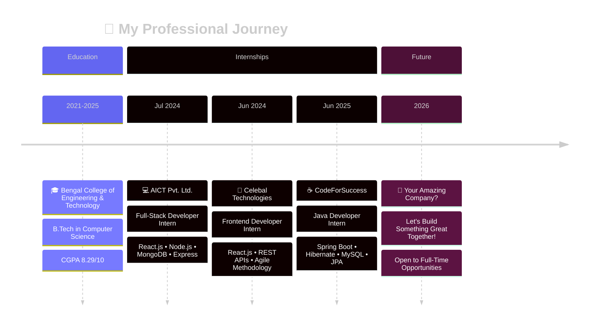

<div align="center">

# 👋 Hey there! I'm Ritik Raja


[](https://www.linkedin.com/in/ritikraja/)
&nbsp;
[](mailto:Ritik.rock121@gmail.com)
&nbsp;
[](https://leetcode.com/u/Ritikraja07/)
&nbsp;
<!-- &nbsp;&nbsp;
[](https://bit.ly/4eRbNf7)

<br/>


-->
</div>

## 🚀 About Me

<div align="center">

**Full Stack Developer** | **Java Spring Boot Backend** | **React Frontend**  
*Building performant, scalable web applications that make a difference*

</div>

<div align="center">

### 🚀 Professional Profile

</div>

<table>
<tr>
<td width="35%" align="center">


<br/><br/>


**🏛️ Bengal College of Engineering & Technology**  
**📅 Graduating Class of 2025**

</td>
<td width="65%">

#### 🎯 Who Am I?

I'm a **Full Stack Developer** passionate about building **scalable, high-performance web applications**. With expertise spanning **Java Spring Boot** backends and **React** frontends, I transform complex problems into elegant solutions. My work has **optimized systems by 40%** and maintained **99% uptime** in production environments.


</td>
</tr>
</table>

---

## 🧑‍💻 Coding Platforms

<div align="center">

<a href="https://www.codechef.com/users/ritik0713" target="_blank">
  
</a>
&nbsp;&nbsp;&nbsp;
<a href="https://www.hackerrank.com/profile/Ritik_rock121" target="_blank">
  
</a>
&nbsp;&nbsp;&nbsp;
<a href="https://leetcode.com/u/Ritikraja07/" target="_blank">
  
</a>

</div>


## 🎯 Current Focus & Growth Path

<table>
<tr>
<td width="50%">

#### 🔍 Actively Learning
```yaml
System Architecture:
  - Microservices Design Patterns
  - Advanced System Design
  - Scalability & Load Balancing

Cloud & DevOps:
  - AWS Cloud Services (EC2, S3, Lambda)
  - Docker Containerization
  - Kubernetes Orchestration
  
Advanced Java:
  - Java 17+ Features
  - Spring Boot 3.x
  - Reactive Programming
```

</td>
<td width="50%">

#### 🚀 Currently Building

**🔥 E-Commerce Platform**  
Full-stack application with Spring Boot & React  
*Focus: Payment Integration, Real-time Inventory*

**🤖 AI Code Review Assistant**  
Smart tool for automated code analysis  
*Tech: TensorFlow.js, NLP, React*

**📊 Analytics Dashboard**  
Real-time data visualization platform  
*Stack: Node.js, MongoDB, Chart.js*

#### 📚 Reading List
- 📖 Designing Data-Intensive Applications
- 📖 Clean Architecture (Robert C. Martin)
- 📖 Spring Boot in Action

</td>
</tr>
</table>

<div align="center">

### 🎯 2026 Goals & Vision


**💡 Mission Statement:** *"Building scalable solutions that solve real-world problems, one commit at a time"*

</div>

<!--

### 🎯 What I Do

🔭 **Currently Building:** Spring Boot microservices & AI-powered web applications  
🌱 **Learning:** Advanced System Design, Cloud Technologies (AWS), Microservices Architecture  
👯 **Open For:** Full Stack Development roles, Open Source collaborations, Freelance projects  
💡 **Expertise:** RESTful APIs, React.js, Spring Boot, Performance Optimization, Database Design  

### ⚡ Key Achievements

📉 Optimized SQL queries by **40%** through indexing and query pattern improvements  
🚀 Reduced API response time by **30%** using code splitting and lazy loading  
📊 Maintained **99% uptime** for production APIs serving 500+ daily requests  
🎯 Mentored **3000+ students** through technical workshops and code reviews  
✅ Achieved **100% on-time delivery** across all sprint cycles


-->
<div align="center">

**💼 Professional Philosophy**

*"Code with purpose, optimize relentlessly, and never stop learning"*

☕ **Code** → 🐛 **Debug** → 🚀 **Deploy** → 🔁 **Repeat**

</div>

---

## 💼 Professional Journey

<div align="center">



</div>

### 💻 Java Developer Intern @ CodeForSuccess
**📅 June 2025 - November 2025** | **📍 Remote**

<div align="left">


</div>

- 🚀 Developed **3 RESTful APIs** using Spring Boot and Hibernate, handling 500+ daily requests
- ⚡ Optimized SQL queries achieving **40% performance improvement** through strategic indexing
- 🗄️ Designed and implemented **8 database tables** with proper normalization in MySQL
- 🔧 Eliminated N+1 query problems using Hibernate ORM for efficient data fetching

---

### 🎨 Frontend Developer Intern @ Celebal Technologies
**📅 June 2024 - August 2024** | **📍 Remote**

<div align="left">


</div>

- 📦 Built a **File Transfer Application** adopted by **3+ cross-functional teams**
- ⚡ Improved response time by **30%** through code splitting and lazy loading techniques
- 🎯 Achieved **100% on-time sprint delivery** in Agile/Scrum environment
- 🔄 Integrated REST APIs for seamless data communication

---

### 🔧 Full-Stack Developer Intern @ AICT Pvt. Ltd.
**📅 July 2024 - August 2024** | **📍 Remote**

<div align="left">


</div>

- 🏗️ Delivered **2 production-ready modules** across 4 sprints using MERN stack
- ✅ Conducted comprehensive testing of **15+ UI components** ensuring 100% functionality
- 📱 Implemented responsive design across **5+ device breakpoints** for optimal user experience
- 👥 Collaborated with team using Git for efficient version control

---

## 🛠️ Tech Arsenal

<div align="center">

### 💻 Backend Development


<!--  -->

<!--  -->

### 🎨 Frontend Development

<!--  -->


### 🗄️ Databases


### 🛠️ Tools & Technologies


### 🎯 Libraries & Frameworks


### 🎨 Design Tools


### ☁️ Deployment & DevOps


</div>

---

## 🏆 Featured Projects

<div align="center">

<table>
<tr>
<td width="50%">

### 🤖 AI Object Detection App
**Next.js • TensorFlow.js • COCO-SSD • Canvas API**

Real-time object detection with in-browser ML inference
- 🎯 **30+ FPS** client-side performance
- 🎨 HTML5 Canvas bounding boxes on webcam feed
- ⚡ **Zero server dependency** - fully client-side
- 🚀 Optimized video stream processing

**Tech Highlights:** WebRTC, TensorFlow.js, Next.js

[](https://object-detection-final-year-project.vercel.app/)
[](https://github.com/Ritikraja07/Object-detection-project)

</td>
<td width="50%">

### 🏠 Homyz Real Estate Platform
**React • Tailwind CSS • Framer Motion • Vite**

Modern real estate web application with smooth animations
- 📈 **15%** increase in lead generation (Q1)
- 💰 **40%** reduction in hosting costs
- 🚀 **Sub-3-minute** deployment pipeline
- 🎨 Seamless scroll animations

**Tech Highlights:** Framer Motion, Responsive Design

[](https://real-estate-homyz-pied.vercel.app/)
[](https://github.com/Ritikraja07/Real-Estate-Homyz-)

</td>
</tr>

<tr>
<td width="50%">

### 🎯 Refokus Website Clone
**React.js • Framer Motion • Locomotive Scroll**

Pixel-perfect animated website with advanced interactions
- 🎬 Smooth scroll with Locomotive Scroll
- 📱 Fully responsive across all devices
- 📊 **30%** boost in user engagement
- 🎥 Video interactivity with React

**Tech Highlights:** Advanced Animations, UX Design

[](https://refokus-website-clone-eight.vercel.app/)
[](https://github.com/Ritikraja07/Refokus_Website)

</td>
<td width="50%">

### 🛒 FreshMart E-Commerce
**HTML5 • CSS3 • JavaScript • Bootstrap • Git**

Modern e-commerce platform with optimized UX
- ⚡ **90+** Lighthouse performance score
- 📱 **20%** faster task completion time
- 🌍 Global deployment via Vercel CI/CD
- 🎨 Interactive UI with adaptive layouts

**Tech Highlights:** Performance Optimization, SEO

[](https://fresh-mart-ecru.vercel.app/)
[](https://github.com/Ritikraja07/FreshMart)

</td>
</tr>
</table>

</div>

---

## 📊 GitHub Analytics

<div align="center">

### 📈 Contribution Stats


 

<!--

### 💻 Coding Activity


-->

### 📉 Contribution Graph

[](https://github.com/Ritikraja07)

</div>

---

## 🏅 Achievements & Recognition

<div align="center">

[](https://holopin.io/@ritikraja07)

<!--  -->

</div>

### 🎓 Certifications & Courses

<div align="center">

| Certification | Platform | Status |
|--------------|----------|--------|
| 🏆 SQL Certification | HackerRank | ✅ Completed |
| 🏆 CSS Certification | HackerRank | ✅ Completed |

</div>

<!--
### 📊 Impact Metrics

```yaml
Career Highlights:
  Code Quality: "40% SQL query optimization"
  Performance: "30% response time reduction"
  Business Impact: "15% lead generation increase"
  Reliability: "99% API uptime maintained"
  Team Collaboration: "100% on-time delivery"
  Testing Coverage: "100% component functionality"
```
-->
---

## 👨‍🏫 Leadership & Community

<div align="center">

### 🎯 Mentor @ CyberCell, BCET
*June 2023 - May 2025*

**Empowering the next generation of developers through hands-on mentorship**

</div>

<!--
```python
class MentorshipImpact:
    def __init__(self):
        self.events_conducted = 10
        self.participants_per_event = 300
        self.total_reach = 3000
        self.project_pass_rate_improvement = "25%"
        self.activities = [
            "Technical Workshops",
            "Weekly Code Reviews",
            "Project Guidance",
            "Career Mentoring",
            "End-to-end Event Management"
        ]
    
    def calculate_impact(self):
        return f"Impacted {self.total_reach}+ students"
```
-->

**🌟 Key Responsibilities:**
- 📚 Conducted **10+ technical workshops** with **300+ participants** each
- 💻 Led weekly code reviews improving project quality by **25%**
- 🎯 Managed end-to-end logistics, outreach, and content planning
- 🤝 Mentored students on real-world project development
- 🚀 Built a community of passionate developers

---

## 📈 Coding Stats

<div align="center">

<!--START_SECTION:waka-->
```text
Java         12 hrs 30 mins  ████████████░░░░░   45.2%
JavaScript   8 hrs 15 mins   ███████░░░░░░░░░░   29.8%
SQL          3 hrs 45 mins   ███░░░░░░░░░░░░░░   13.5%
HTML/CSS     2 hrs 10 mins   ██░░░░░░░░░░░░░░░    7.8%
Other        1 hr 5 mins     █░░░░░░░░░░░░░░░░    3.7%
```
<!--END_SECTION:waka-->

</div>

---
<!--
## 🎯 What I'm Currently Up To

<div align="center">

```javascript
const currentFocus = {
    learning: [
        "Advanced Spring Boot Patterns",
        "Microservices Architecture",
        "System Design",
        "AWS Cloud Services",
        "Docker & Kubernetes"
    ],
    building: [
        "🔥 Full-stack e-commerce platform with Spring Boot & React",
        "🤖 AI-powered code review assistant",
        "📊 Real-time analytics dashboard"
    ],
    reading: [
        "📖 Designing Data-Intensive Applications",
        "📖 Clean Architecture",
        "📖 Spring Boot in Action"
    ],
    goals2025: [
        "🎯 Master Spring Boot Microservices",
        "🎯 Contribute to 5+ open source projects",
        "🎯 Build and deploy 10 full-stack applications",
        "🎯 Write 20+ technical blog posts"
    ]
};
```

</div>

---
-->

<!--
## 📝 Latest Blog Posts & Articles

<div align="center">

-->

<!-- BLOG-POST-LIST:START -->
<!--
### 📚 Check out my technical writing on Medium!

I write about:
- ⚛️ React.js best practices and patterns
- 🍃 Spring Boot development tips
- ⚡ Performance optimization techniques
- 🎨 Frontend architecture & design systems
- 🔧 Developer productivity hacks

[](https://medium.com/@ritik.rock121)


</div>
-->

## 💭 Daily Dev Wisdom

<div align="center">


### 💡 My Development Philosophy

*"Write code that speaks for itself, optimize ruthlessly, and never stop learning. Every bug is a lesson, every feature is an opportunity to excel."*

</div>

---


## 🤝 Let's Connect & Collaborate!

<div align="center">

### I'm always excited to work on innovative projects! 🚀

**Currently Open For:**

🎯 **Full Stack Development Roles** (Java + React)  
🤝 **Open Source Collaborations**  
💼 **Freelance Projects**  
🎓 **Technical Mentorship**  
📚 **Tech Discussions & Knowledge Sharing**

### 📬 Get In Touch

[](https://www.linkedin.com/in/ritikraja/)
[](mailto:Ritik.rock121@gmail.com)
[](https://bit.ly/4eRbNf7)
[](https://medium.com/@ritik.rock121)
[](https://quora.com/profile/Ritik-Raja-11)


<!--
### ☕ Support My Work

If you like my projects and find them helpful, consider buying me a coffee! ☕

[](https://buymeacoffee.com/Ritikraja)

</div>

---

<div align="center">


### 🎨 Fun Zone


---

### 💻 "First, solve the problem. Then, write the code." – John Johnson


---

### 📊 Visitor Analytics


---

**⚡ "Building the future, one commit at a time"**

Made with ❤️, ☕, and countless hours of debugging by **Ritik Raja**

⭐️ From [Ritikraja07](https://github.com/Ritikraja07)

*Last Updated: January 2025*

</div>

-->
